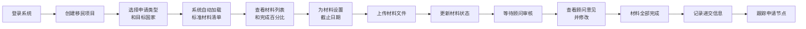
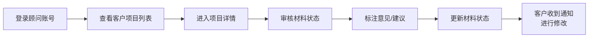

## 1. 产品概述

移民申请材料管理工具是一款面向移民申请人和移民顾问的专业材料管理平台，解决移民申请过程中材料准备繁琐、状态追踪困难、进度不透明等痛点，实现申请全流程数字化管理。

- 主要用途：帮助用户系统化管理移民申请材料，追踪申请进度，与顾问高效协作
- 目标用户：移民申请人（客户）、移民顾问
- 核心价值：降低材料遗漏风险，提高申请效率，实现申请进度可视化

## 2. 核心功能

### 2.1 用户角色

| 角色 | 登录方式 | 核心权限 |
|------|----------|----------|
| 客户 | 账号密码登录 | 创建/查看项目、上传材料、设置截止日期、查看顾问意见、更新申请节点 |
| 顾问 | 账号密码登录 | 定制材料清单、查看所有项目、标注意见、更新材料状态、管理客户信息 |

### 2.2 功能模块

1. **项目管理页**：项目列表、创建项目、项目概览、完成度统计
2. **材料管理页**：材料清单展示、状态管理、截止日期设置、文件上传、版本管理、类型分组
3. **顾问协作页**：意见标注、材料审核、状态更新
4. **申请进度页**：递交记录、节点更新、提醒通知
5. **系统设置页**：材料清单模板管理、用户信息

### 2.3 页面详情

| 页面名称 | 模块名称 | 功能描述 |
|-----------|-------------|---------------------|
| 登录页 | 登录模块 | 账号密码登录，角色选择 |
| 项目管理 | 项目列表 | 展示所有项目卡片，显示完成百分比、申请类型、目标国家 |
| 项目管理 | 创建项目 | 选择申请类型（工作签证/永久居留/入籍）、目标国家、填写项目名称 |
| 项目管理 | 项目概览 | 展示项目基本信息、整体完成度、待办提醒、近期截止日期 |
| 材料清单 | 材料列表 | 按类别分组展示标准材料清单，显示状态、截止日期、版本信息 |
| 材料清单 | 状态管理 | 切换材料状态：待准备/已上传/待公证/已公证/已提交 |
| 材料清单 | 文件管理 | 上传材料文件、查看历史版本、替换新版本、按类型归档 |
| 材料清单 | 截止日期 | 为每项材料设置截止日期，接近截止时高亮提醒 |
| 顾问协作 | 意见标注 | 顾问对材料标注意见，客户可见并可回复 |
| 申请进度 | 递交记录 | 记录递交日期、申请编号、受理机构 |
| 申请进度 | 节点管理 | 手动更新重要节点（面签通知/审批结果），设置提醒 |
| 系统设置 | 清单模板 | 顾问可定制不同申请类型的标准材料清单 |

## 3. 核心流程

### 3.1 客户创建项目流程

### 3.2 顾问审核流程

## 4. 用户界面设计

### 4.1 设计风格

- **主色调**：深蓝 (#1e3a5f) - 专业、可信赖
- **辅助色**：金色 (#d4a855) - 高端、尊贵
- **状态色**：
  - 待准备：灰色 (#6b7280)
  - 已上传：蓝色 (#3b82f6)
  - 待公证：橙色 (#f97316)
  - 已公证：紫色 (#8b5cf6)
  - 已提交：绿色 (#10b981)
- **字体**：展示字体使用 Playfair Display（优雅专业），正文字体使用 Noto Sans SC（清晰可读）
- **按钮风格**：圆角4px，微阴影，hover状态轻微上浮
- **布局风格**：卡片式布局，侧边导航 + 主内容区，留白充足
- **图标风格**：lucide-react 线性图标，保持简洁一致

### 4.2 页面设计概述

| 页面名称 | 模块名称 | UI Elements |
|-----------|-------------|-------------|
| 项目管理 | 项目卡片 | 渐变背景，进度环动画，悬浮效果 |
| 材料清单 | 材料表格 | 行悬停高亮，状态标签动画，分组折叠/展开 |
| 材料上传 | 上传区域 | 拖拽上传，进度条动画，版本时间线 |
| 进度追踪 | 时间线 | 竖向时间线，节点状态颜色区分 |
| 顾问意见 | 评论区 | 气泡样式，区分客户/顾问角色，时间戳 |

### 4.3 响应式

- 桌面优先设计，适配 1280px 以上
- 平板端：侧边栏收起为图标导航
- 移动端：底部导航栏，卡片单列布局
- 触摸优化：按钮最小高度44px，手势滑动操作

### 4.4 动效设计

- 页面加载：元素渐入 + 轻微上浮动画，stagger 效果
- 状态变更：状态标签颜色过渡 + 缩放动效
- 进度更新：进度环 SVG 描边动画
- 通知提醒：右上角滑入 + 轻微震动
- 卡片悬停：阴影加深 + Y轴-2px 位移
