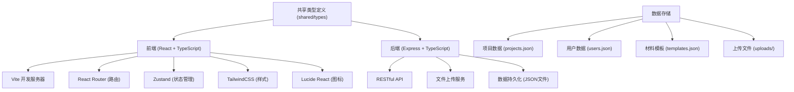
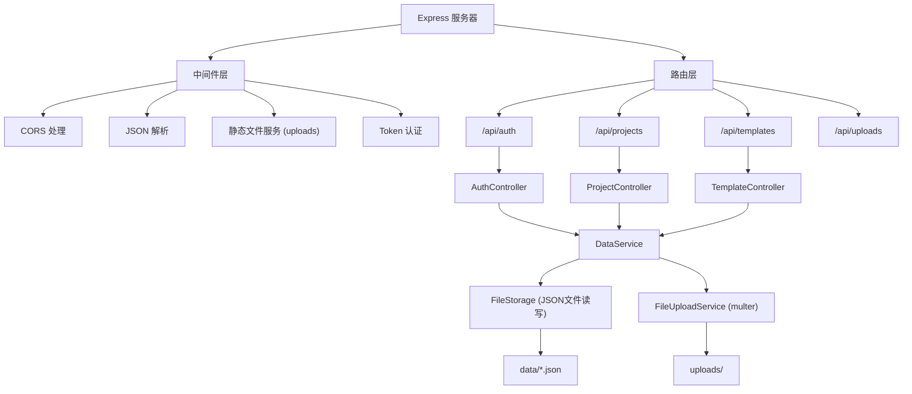
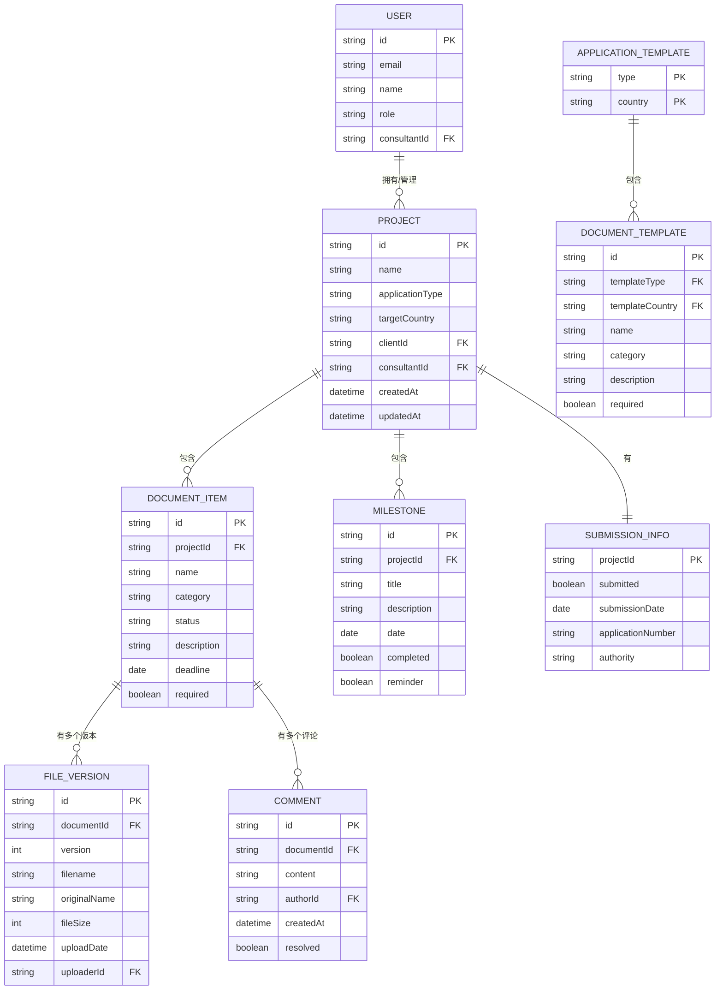

## 1. 架构设计



## 2. 技术描述

- **前端**: React@18 + TypeScript + Vite@6
- **路由**: react-router-dom@6
- **状态管理**: zustand@4
- **样式**: tailwindcss@3
- **图标**: lucide-react@0.344.0
- **后端**: Express@4 + TypeScript
- **文件上传**: multer@1.4.5-lts.1
- **开发工具**: concurrently@8, nodemon@3
- **数据库**: 本地JSON文件存储（便于演示，可扩展为PostgreSQL）

## 3. 路由定义

### 前端路由

| 路由 | 页面 | 访问权限 |
|-------|---------|----------|
| /login | 登录页 | 公开 |
| /projects | 项目列表页 | 客户/顾问 |
| /projects/new | 创建项目页 | 客户/顾问 |
| /projects/:id | 项目概览页 | 客户/顾问 |
| /projects/:id/documents | 材料清单页 | 客户/顾问 |
| /projects/:id/progress | 申请进度页 | 客户/顾问 |
| /settings/templates | 材料模板管理 | 顾问 |

### 后端API路由

| 方法 | 路由 | 用途 |
|------|-------|------|
| POST | /api/auth/login | 用户登录 |
| GET | /api/projects | 获取项目列表 |
| POST | /api/projects | 创建新项目 |
| GET | /api/projects/:id | 获取项目详情 |
| PUT | /api/projects/:id | 更新项目信息 |
| GET | /api/projects/:id/documents | 获取项目材料清单 |
| PUT | /api/projects/:id/documents/:docId | 更新材料状态/信息 |
| POST | /api/projects/:id/documents/:docId/upload | 上传材料文件 |
| GET | /api/projects/:id/documents/:docId/versions | 获取文件版本历史 |
| POST | /api/projects/:id/documents/:docId/comments | 添加顾问意见 |
| PUT | /api/projects/:id/submission | 更新递交信息 |
| POST | /api/projects/:id/milestones | 添加申请节点 |
| GET | /api/templates | 获取材料清单模板 |
| PUT | /api/templates/:type | 更新材料清单模板 |
| GET | /uploads/:filename | 获取上传文件 |

## 4. API 类型定义

```typescript
// 用户角色
export type UserRole = 'client' | 'consultant';

// 申请类型
export type ApplicationType = 'work_visa' | 'permanent_residence' | 'citizenship';

// 材料状态
export type DocumentStatus = 'pending' | 'uploaded' | 'notarization_pending' | 'notarized' | 'submitted';

// 材料类别
export type DocumentCategory = 'identity' | 'education' | 'work' | 'finance' | 'health' | 'other';

// 用户
export interface User {
  id: string;
  email: string;
  name: string;
  role: UserRole;
  consultantId?: string; // 客户所属顾问ID
  avatar?: string;
}

// 材料文件版本
export interface FileVersion {
  id: string;
  version: number;
  filename: string;
  originalName: string;
  fileSize: number;
  uploadDate: string;
  uploaderId: string;
  note?: string;
}

// 顾问意见
export interface Comment {
  id: string;
  content: string;
  authorId: string;
  authorName: string;
  authorRole: UserRole;
  createdAt: string;
  resolved: boolean;
}

// 材料项
export interface DocumentItem {
  id: string;
  name: string;
  category: DocumentCategory;
  status: DocumentStatus;
  description: string;
  deadline?: string;
  currentVersion?: FileVersion;
  versions: FileVersion[];
  comments: Comment[];
  required: boolean;
}

// 申请节点
export interface Milestone {
  id: string;
  title: string;
  description: string;
  date: string;
  completed: boolean;
  reminder: boolean;
}

// 递交信息
export interface SubmissionInfo {
  submitted: boolean;
  submissionDate?: string;
  applicationNumber?: string;
  authority?: string;
  notes?: string;
}

// 移民项目
export interface Project {
  id: string;
  name: string;
  applicationType: ApplicationType;
  targetCountry: string;
  clientId: string;
  clientName: string;
  consultantId?: string;
  createdAt: string;
  updatedAt: string;
  documents: DocumentItem[];
  submission: SubmissionInfo;
  milestones: Milestone[];
}

// 材料模板
export interface DocumentTemplate {
  id: string;
  name: string;
  category: DocumentCategory;
  description: string;
  required: boolean;
}

export interface ApplicationTemplate {
  type: ApplicationType;
  country: string;
  documents: DocumentTemplate[];
}
```

## 5. 服务器架构



## 6. 数据模型

### 6.1 ER 图



### 6.2 初始数据

#### users.json
```json
[
  {
    "id": "consultant_1",
    "email": "consultant@example.com",
    "password": "123456",
    "name": "张顾问",
    "role": "consultant"
  },
  {
    "id": "client_1",
    "email": "client@example.com",
    "password": "123456",
    "name": "李客户",
    "role": "client",
    "consultantId": "consultant_1"
  }
]
```

#### templates.json
```json
[
  {
    "type": "work_visa",
    "country": "加拿大",
    "documents": [
      { "id": "t1", "name": "有效护照", "category": "identity", "description": "护照有效期至少6个月", "required": true },
      { "id": "t2", "name": "工作offer", "category": "work", "description": "加拿大雇主提供的正式工作邀请", "required": true },
      { "id": "t3", "name": "学历证明", "category": "education", "description": "最高学历证书及成绩单", "required": true },
      { "id": "t4", "name": "工作经历证明", "category": "work", "description": "过往工作推荐信", "required": true },
      { "id": "t5", "name": "语言成绩", "category": "education", "description": "雅思/TEF成绩", "required": true },
      { "id": "t6", "name": "无犯罪记录证明", "category": "other", "description": "近10年居住国无犯罪记录", "required": true },
      { "id": "t7", "name": "体检报告", "category": "health", "description": "移民局指定医院体检", "required": true },
      { "id": "t8", "name": "资金证明", "category": "finance", "description": "足够的安家费用证明", "required": false }
    ]
  },
  {
    "type": "permanent_residence",
    "country": "加拿大",
    "documents": [
      { "id": "p1", "name": "有效护照", "category": "identity", "description": "所有家庭成员护照", "required": true },
      { "id": "p2", "name": "出生证明", "category": "identity", "description": "主申请人及家属出生公证", "required": true },
      { "id": "p3", "name": "结婚证/单身证明", "category": "identity", "description": "婚姻状况证明", "required": true },
      { "id": "p4", "name": "学历认证", "category": "education", "description": "ECA学历认证报告", "required": true },
      { "id": "p5", "name": "语言成绩", "category": "education", "description": "CLB 7以上", "required": true },
      { "id": "p6", "name": "工作经验证明", "category": "work", "description": "近10年工作经验", "required": true },
      { "id": "p7", "name": "无犯罪记录", "category": "other", "description": "所有年满18岁家庭成员", "required": true },
      { "id": "p8", "name": "体检报告", "category": "health", "description": "所有家庭成员", "required": true },
      { "id": "p9", "name": "资金证明", "category": "finance", "description": "满足最低安家费要求", "required": true },
      { "id": "p10", "name": "照片", "category": "other", "description": "符合规格的电子照片", "required": true }
    ]
  },
  {
    "type": "citizenship",
    "country": "加拿大",
    "documents": [
      { "id": "c1", "name": "永久居民卡", "category": "identity", "description": "正反面复印件", "required": true },
      { "id": "c2", "name": "居住证明", "category": "other", "description": "过去5年住满3年证明", "required": true },
      { "id": "c3", "name": "护照", "category": "identity", "description": "所有出入境盖章页", "required": true },
      { "id": "c4", "name": "语言成绩", "category": "education", "description": "CLB 4以上", "required": true },
      { "id": "c5", "name": "纳税证明", "category": "finance", "description": "过去3年报税记录", "required": true },
      { "id": "c6", "name": "入籍考试", "category": "other", "description": "考试通过证明", "required": false }
    ]
  }
]
```
